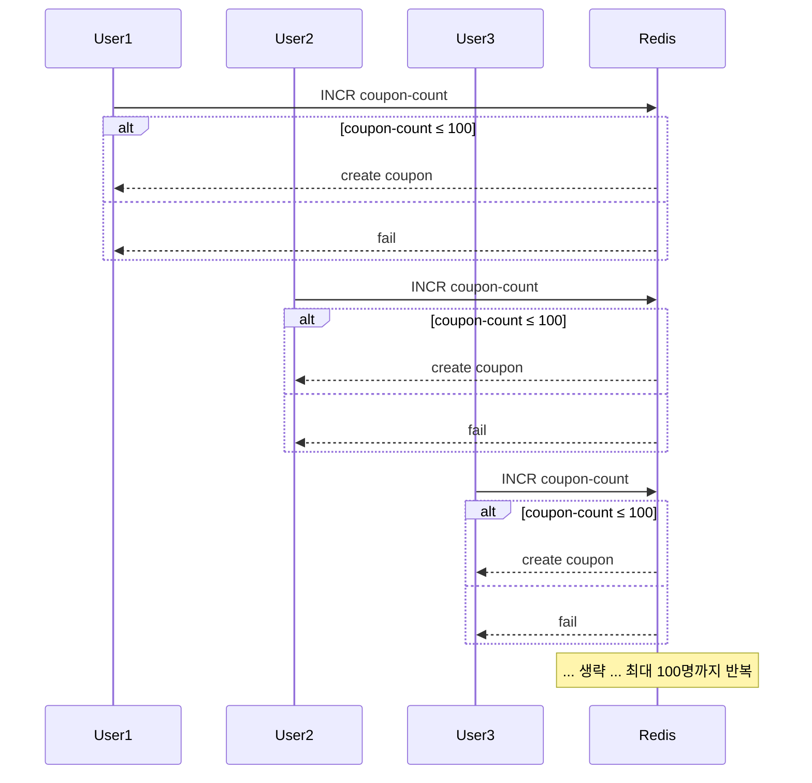
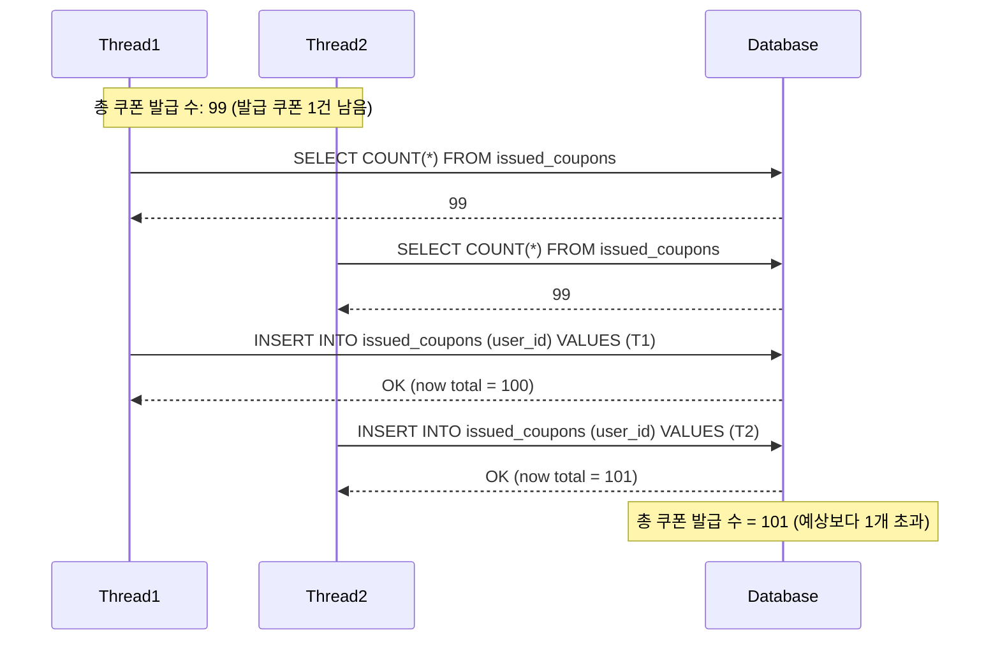
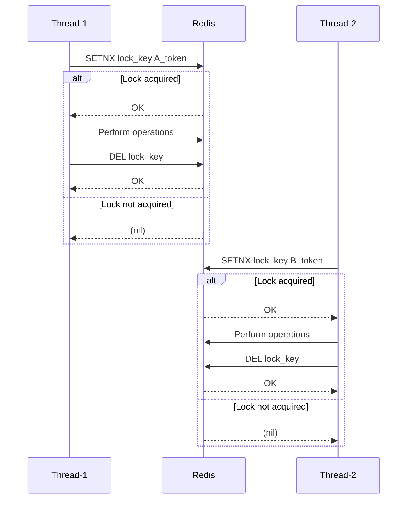

# study-first-come-system-greatfarmer

## 요구사항
- 할인쿠폰은 선착순 100명에게만 발급되어야 한다.
- 들어온 순서대로 쿠폰을 발급해야 한다. (First Come, First Served)
- 동시성 이슈를 해결하고 쿠폰 발급 개수를 보장해야 한다.
- 순간적으로 몰리는 트래픽을 버틸 수 있어야 한다.

## 추가 요구사항
- 할인 쿠폰 발행은 특정 "이벤트 기간"에 제한됩니다.
    - ex. 이벤트 기간 5월 1일부터 5월 5일까지 쿠폰 발행 이벤트 기간입니다.
- 할인 쿠폰은 이벤트 기간동안 매일 특정 시간에 시작하여 "일정 시간 동안"만 발행됩니다.
    - ex. 오후 1시에 시작하여 3시까지 발행 가능합니다.
- 할인 쿠폰은 "하루 당 발행 가능한 최대 수량"은 정해져 있습니다.
    - ex. 쿠폰의 최대 발행 수량은 하루에 100개입니다.
- 할인 쿠폰은 "선착순"으로 하루에 "한 명의 사용자 당 1개만" 발급 가능합니다.
- 할인 쿠폰 발급 가능 수량은 이벤트 기간 동안 "매일 갱신" 됩니다.
- 할인 쿠폰은 이벤트 기간 종료 후 "유효기간 동안"만 사용 가능합니다.
    - ex. 이벤트 기간 종료 후 50% 할인 쿠폰은 1달 이내에 사용되어야 합니다.
- 참고: https://www.youtube.com/watch?v=VUdpb0FFsY4

## 목표
- 레디스의 분산락을 사용하여 동시성 이슈 해결 구현
- K6로 부하테스트
- (옵션) 카프카로 선착순 시스템 구현

## 키워드
- Java
   1. [Synchronized Block](https://medium.com/@RamLakshmanan/java-synchronized-block-acb1cfc2ea77)
   2. [Reentrant Lock](https://www.geeksforgeeks.org/reentrant-lock-java/)
   3. [CAS](https://jenkov.com/tutorials/java-concurrency/compare-and-swap.html)
- DB
   1. [Pessimistic Lock](https://medium.com/@abhirup.acharya009/managing-concurrent-access-optimistic-locking-vs-pessimistic-locking-0f6a64294db7)
   2. [Optimistic Lock](https://medium.com/@abhirup.acharya009/managing-concurrent-access-optimistic-locking-vs-pessimistic-locking-0f6a64294db7)
- Redis
   1. [Distributed Lock](https://martin.kleppmann.com/2016/02/08/how-to-do-distributed-locking.html)

## 시퀀스 다이어그램

## 동시성 이슈 해결
> 출처: https://nooblette.tistory.com/entry/%EC%8B%9C%EC%8A%A4%ED%85%9C-%EB%94%94%EC%9E%90%EC%9D%B8-%EC%8B%A4%EC%8A%B5%EC%9C%BC%EB%A1%9C-%EB%B0%B0%EC%9A%B0%EB%8A%94-%EC%84%A0%EC%B0%A9%EC%88%9C-%EC%9D%B4%EB%B2%A4%ED%8A%B8-%EC%8B%9C%EC%8A%A4%ED%85%9C-13-%EB%8F%99%EC%8B%9C%EC%84%B1-%EC%9D%B4%EC%8A%88%EC%99%80-Redis%EB%A1%9C-%ED%95%B4%EA%B2%B0%ED%95%98%EA%B8%B0
### 원인

### 해결방법
| 시간       | Thread-1                         | Redis (Coupon count) | Thread-2                         |
|------------|----------------------------------|------------------------|----------------------------------|
| 10:00:01   | 쿠폰 카운트 1 증가 로직 시작     | 99                     |                                  |
| 10:00:02   | `incr coupon-count`              | 100                    | 쿠폰 카운트 1 증가 로직 시작     |
| 10:00:03   |                                  | 100                    | wait                             |
| 10:00:04   | 쿠폰 카운트 1 증가 로직 종료     | 100                    | 쿠폰 카운트 1 증가 로직 시작     |
|            | create coupon                    |                        |                                  |
| 10:00:05   |                                  | 101                    | `incr coupon-count`              |
|            |                                  | 101                    | **failed create coupon**         |

## API
- POST /v1/coupon/issue
- GET /v1/coupon/count

## 참고
- https://nooblette.tistory.com/entry/%EC%8B%9C%EC%8A%A4%ED%85%9C-%EB%94%94%EC%9E%90%EC%9D%B8-%EC%8B%A4%EC%8A%B5%EC%9C%BC%EB%A1%9C-%EB%B0%B0%EC%9A%B0%EB%8A%94-%EC%84%A0%EC%B0%A9%EC%88%9C-%EC%9D%B4%EB%B2%A4%ED%8A%B8-%EC%8B%9C%EC%8A%A4%ED%85%9C-13-%EB%8F%99%EC%8B%9C%EC%84%B1-%EC%9D%B4%EC%8A%88%EC%99%80-Redis%EB%A1%9C-%ED%95%B4%EA%B2%B0%ED%95%98%EA%B8%B0
- https://mangkyu.tistory.com/311
- https://oliveyoung.tech/2023-08-07/async-process-of-coupon-issuance-using-redis/
- https://techblog.gccompany.co.kr/apache-kafka%EB%A5%BC-%EC%82%AC%EC%9A%A9%ED%95%98%EC%97%AC-eda-%EC%A0%81%EC%9A%A9%ED%95%98%EA%B8%B0-bf263c79efd0
- https://medium.com/glovo-engineering/the-discounts-microservice-14f4d4e4d6c9
- https://techblog.gccompany.co.kr/redis-kafka%EB%A5%BC-%ED%99%9C%EC%9A%A9%ED%95%9C-%EC%84%A0%EC%B0%A9%EC%88%9C-%EC%BF%A0%ED%8F%B0-%EC%9D%B4%EB%B2%A4%ED%8A%B8-%EA%B0%9C%EB%B0%9C%EA%B8%B0-feat-%EB%84%A4%EA%B3%A0%EC%99%95-ec6682e39731